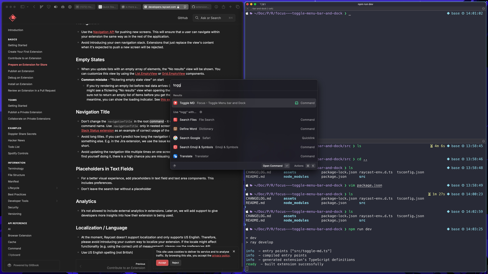
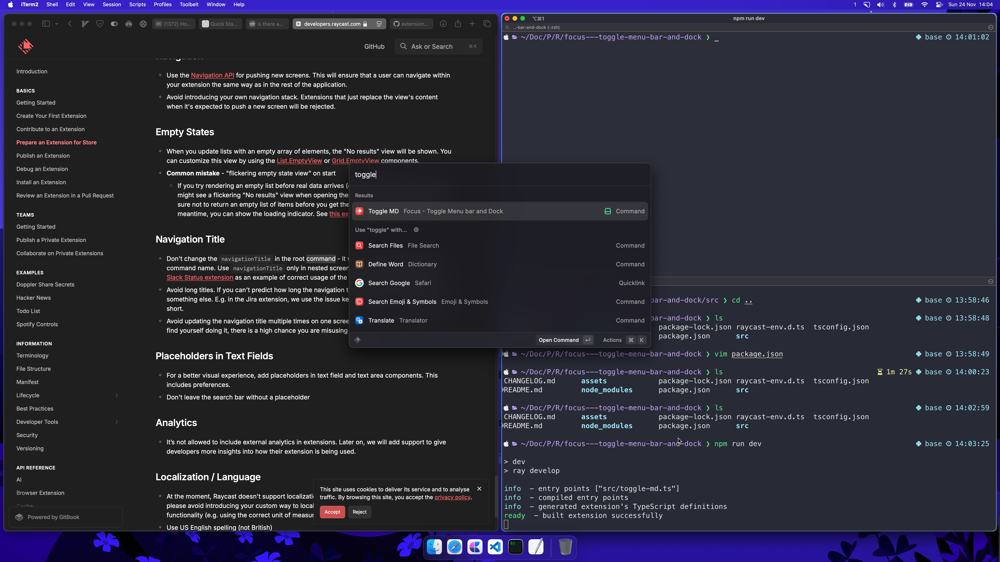

# Toggle Menu bar and Dock

This extension toggles both the menu bar and dock on and off. It's like full screen mode but without going into full screen.

# Command
The command to toggle on and off is  ``` Toggle Md ``` <br>
(M)enu and (d)ock

# Demo
## Toggled On


## Toggled Off

